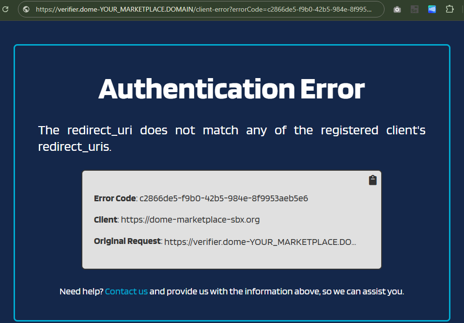

# Authentication error
This page will help your to solve this issue.

## Symtom

### Error on the web

1. Go to your DOME Marketplace url https://dome-YOUR_MARKETPLACE.DOMAIN

2. Clic on the Login button 



### Error in logs
Learn how to get detailed information about what is happening:

```bash
{TIMESTAMP} ERROR 1 --- [VC Verifier] [nio-8080-exec-7] .s.f.CustomAuthorizationRequestConverter : {UUID_ERROR_CODE} - The redirect_uri does not match any of the registered client's redirect_uris.
{TIMESTAMP}  INFO 1 --- [VC Verifier] [nio-8080-exec-8] .s.f.CustomAuthorizationRequestConverter : CustomAuthorizationRequestConverter.convert
{TIMESTAMP}  INFO 1 --- [VC Verifier] [nio-8080-exec-8] .s.f.CustomAuthorizationRequestConverter : Retrieving JWT from request_uri: https://dome-YOUR_MARKETPLACE.DOMAIN/auth/vc/request.jwt
```


## Cause
Common reasons for an authentication error are following:

- Not completed all the required steps in the permissioning process.
- The verifier-api is out-of-date.
- The verifier-api is out-of-sync with the trusted list updates generated in the permissioning process.

## Solution

1. Be sure you complete all the required steps in the permissioning process. link

2. Force the update on the verifier-api pod. 
Get the pod name. 
You should change the namespace name as in your current installation.

```shell
kubectl -n marketplace get pod | grep -i 'verifier-api'

Output:
verifier-api-878d5d87c-bhklc                  1/1     Running   0         2d20h
```

3. Delete the verifier-api pod. 

```shell
kubectl delete pod verifier-api -n marketplace
```

NOT SOLVED :(